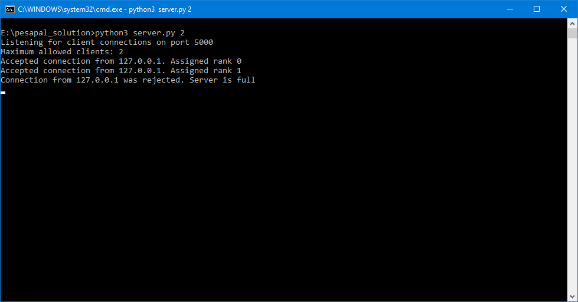
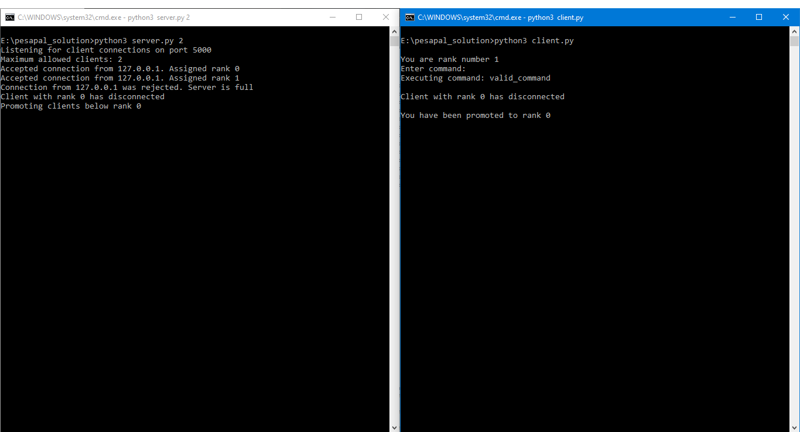

# Pesapal Developer Challenge
This is a solution for [The Pesapal Developer Challenge](https://pesapal.freshteam.com/jobs/2OU7qEKgG4DR/junior-developer-23) *Problem 3: A distributed system*, written in Python3.

## Problem Statement
Build a TCP server that can accept and hold a maximum of N clients (where N is configurable).
These clients are assigned ranks based on first-come-first-serve, i.e whoever connects first receives the next available high rank. Ranks are from 0–N, 0 being the highest rank.

Clients can send to the server commands that the server distributes among the clients. Only a client with a lower rank can execute a command of a higher rank client. Higher rank clients cannot execute commands by lower rank clients, so these commands are rejected. The command execution can be as simple as the client printing to console that command has been executed.

If a client disconnects the server should re-adjust the ranks and promote any client that needs to be promoted not to leave any gaps in the ranks.

## Setup and running the solution
1. Clone or download this repository
2. Make sure python3 is installed and accessible from the terminal. At least version 3.9.1 is needed. [Installation Guide 1](https://wiki.python.org/moin/BeginnersGuide/Download), [Installation Guide 2](https://www.digitalocean.com/community/tutorials/install-python-windows-10)
3. Open a new terminal session and navigate to the solution folder
4. Run `python server.py [max_clients]`, where `[max_clients]` is the maximum number of clients the server should allow to be connected at any one time. If not provided, a default value of 3 will be used
5. Repeat step 3 and run `python client.py` as many times as desired, until the server is full
6. Type in the terminal to send commands to lower-ranked clients
7. To send a command to lower-ranked clients, make sure to prefix the command with the forward-slash character like so: `/command`

## Troubleshooting
- Error (on Windows OS): `python is not recognized`. This can occur if the python executable was not added to PATH during installation. Follow [this guide](https://www.digitalocean.com/community/tutorials/install-python-windows-10) and make sure `Add Python to PATH is checked`.
- Error (on Linux or macOS): `python is not found` or `python syntax error`. This might indicate that both python2 and python3 are installed side by side. Try running the scripts by substituting `python` with `python3`.

## Solution Overview
The solution consists of 2 scripts:
- `server.py`, which contains the distributed system server
- `client.py`, which contains the distributed system client

The system is built with a thin-client design, where the server handles all ranking and command-distribution logic, and clients only receive and display messages from the server and execute commands relayed to them.

Clients have no innate understanding of the ranking system or knowledge about other clients connected to the server.

Commands must be prefixed with the forward slash character, in order to be relayed to other clients. Failure to do so will result in an error message from the server.

In future, other command syntax could be implemented to allow clients to send commands to the server for purposes of enumerating connected clients, manual rank promotion, etc.

## Code Overview
The server runs a thread to handle incoming client connections. When a connection is received and the server is not yet full, a new thread is created to handle communication with the individual client.

#### Connection Handling
https://github.com/ANSH3LL/pesapal-dev-challenge/blob/4383bb321058776605364583181eec91b4c53f1b/server.py#L54-L78

#### Client Thread
https://github.com/ANSH3LL/pesapal-dev-challenge/blob/4383bb321058776605364583181eec91b4c53f1b/server.py#L80-L100

Client objects are stored in a dictionary with their rank as the key. This key is subject to change on the event of a client disconnecting from the server and a promotion of lower-ranking clients taking place.

#### Promotion Logic
https://github.com/ANSH3LL/pesapal-dev-challenge/blob/4383bb321058776605364583181eec91b4c53f1b/server.py#L117-L139

The server broadcasts messages to clients when various events such as connection and disconnection of clients occur.

#### Message Broadcasting
https://github.com/ANSH3LL/pesapal-dev-challenge/blob/4383bb321058776605364583181eec91b4c53f1b/server.py#L102-L115

Commands sent from clients are only relayed to clients of a lower rank. The server also checks the command syntax for correctness.

#### Command Relay
https://github.com/ANSH3LL/pesapal-dev-challenge/blob/4383bb321058776605364583181eec91b4c53f1b/server.py#L141-L159

The client is very simple and only runs one thread for the sake of receiving incoming messages. Anything typed in the terminal is sent as-is to the server.

#### Client Logic
https://github.com/ANSH3LL/pesapal-dev-challenge/blob/4383bb321058776605364583181eec91b4c53f1b/client.py#L4-L32

## Screenshots
#### Client connection and commands

#### Server has maximum clients connected

#### Client rank promotion
